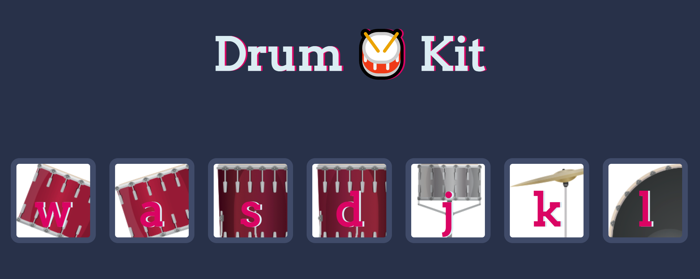

# Interactive Drum Kit 🥁

An interactive drum kit web application built with HTML, CSS, and JavaScript.

Users can play different percussion sounds by clicking the drum buttons or pressing the corresponding keys on their keyboard. This project demonstrates DOM manipulation, event handling, audio playback, loops, functions, and switch statements in JavaScript.

## Live Demo

[Play the Drum Kit](YOUR-GITHUB-PAGES-LINK)

## Preview

## Features

- Seven interactive drum buttons
- Mouse click controls
- Keyboard controls
- A different sound assigned to each drum pad
- Real-time audio playback
- Visual drum illustrations
- Button animation when a sound is played
- Simple and responsive interface

## Controls

You can play the drum kit by clicking the buttons or pressing these keyboard keys:

| Key | Sound |
|-----|-------|
| `W` | Tom 1 |
| `A` | Tom 2 |
| `S` | Tom 3 |
| `D` | Tom 4 |
| `J` | Snare |
| `K` | Crash cymbal |
| `L` | Kick bass |

## How It Works

JavaScript listens for two types of user interaction:

1. A click on one of the drum buttons
2. A keyboard press using one of the assigned keys

When an interaction is detected, the application:

1. Identifies the selected button or keyboard key
2. Passes its value to the sound function
3. Uses a `switch` statement to select the corresponding audio file
4. Plays the sound
5. Applies a temporary visual animation to the selected drum button
